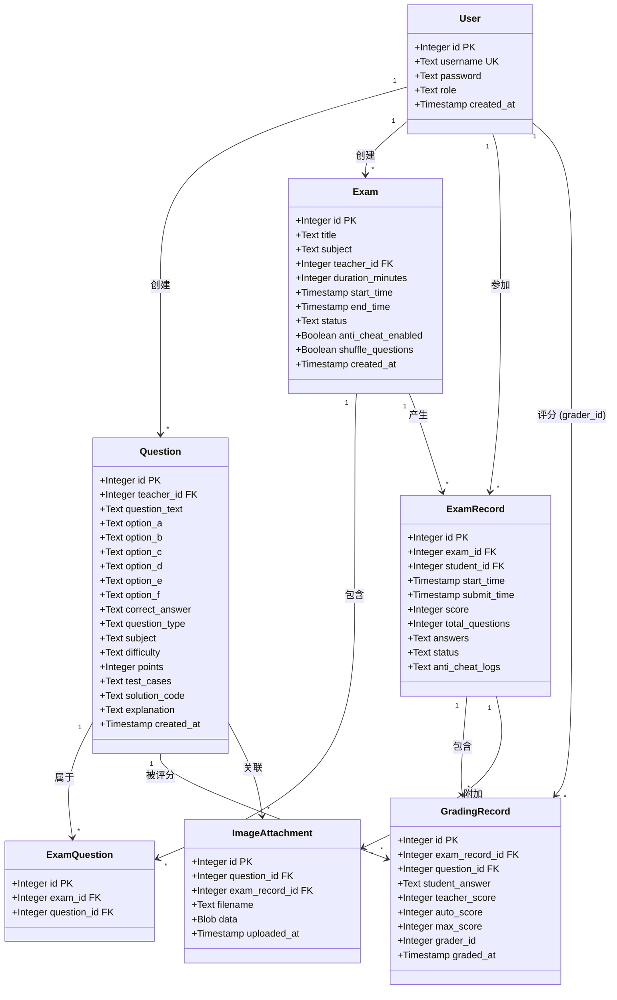
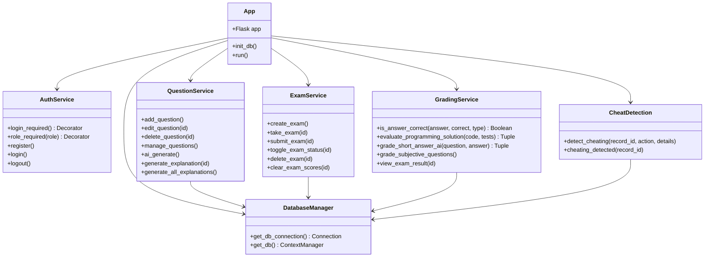
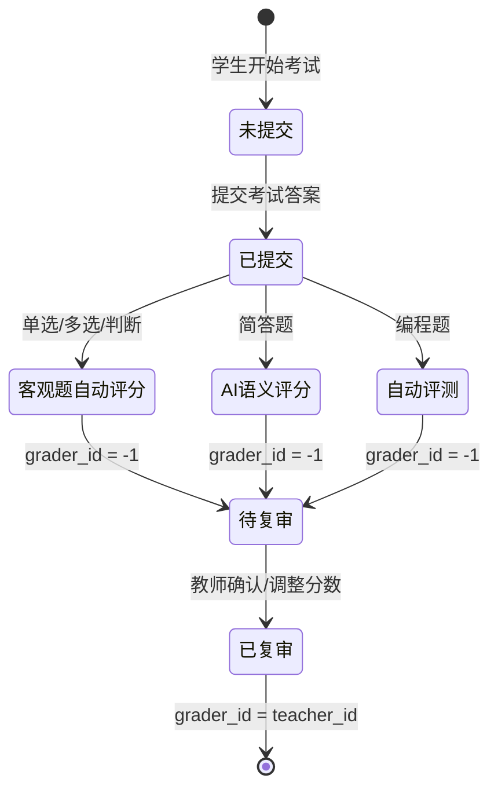

# 在线考试系统 — 说明文档

> **版本**：v2.0  
> **技术栈**：Python + Flask + SQLite + DashScope（通义千问大模型）  
> **最后更新**：2026-06

---

## 一、系统概述

本系统是一个基于 Flask 的在线考试平台，集成了 AI 智能出题、自动评分、人工复审、防作弊监控等功能，支持单选题、多选题、判断题、简答题、编程题五种题型，面向教师和学生两类用户角色。

### 技术架构

| 层级 | 技术选型 | 说明 |
|------|---------|------|
| 前端 | Bootstrap 5 + Jinja2 + Summernote | 响应式 UI + 富文本编辑 |
| 后端 | Flask (Python) | 轻量级 Web 框架 |
| 数据库 | SQLite | 轻量级关系型数据库，通过上下文管理器统一连接 |
| AI 服务 | DashScope (通义千问 qwen-max) | 出题、评分、解析生成 |
| 代码评测 | subprocess 隔离执行 | 编程题安全沙箱评测 |

---

## 二、核心功能

### 1. 用户角色管理

- **教师**：添加/编辑/删除题目、AI 出题、创建考试、查看成绩、评分复审、管理考试状态
- **学生**：参加考试、查看历史成绩、考后查看试卷与解析

### 2. 题目管理（5 种题型）

| 题型 | 字段标识 | 自动评分 | 说明 |
|------|---------|---------|------|
| 单选题 | `multiple_choice` | ✅ | 4 选项，1 个正确答案 |
| 多选题 | `multiple_select` | ✅ | 4-6 选项（A-F），多个正确答案逗号分隔 |
| 判断题 | `true_false` | ✅ | A=正确，B=错误 |
| 简答题 | `short_answer` | AI 评分 + 人工复审 | 参考答案比对，AI 语义评分 |
| 编程题 | `programming` | 自动评测 + 人工复审 | subprocess 隔离执行测试用例 |

### 3. AI 智能出题

- 支持选择**题型**（单选/多选/判断/简答/编程）和输入**专业课主题**
- 内置 15 门常见专业课建议（数据结构、计算机网络、操作系统等）
- AI 生成题目时**自动配套生成解析**入库
- 可设置难度（简单/中等/困难）和生成数量（1-20 题）

### 4. 评分系统

- **客观题**（单选/多选/判断）：提交后自动判分，创建 `grading_records`（`grader_id = -1` 标记 AI 批改）
- **简答题**：AI 语义评分（0-10 分映射到实际分值），`grader_id = -1`
- **编程题**：subprocess 隔离执行测试用例，按通过率自动评分
- **人工复审**：教师可在评分复审页面查看所有 AI 批改结果，调整分数后 `grader_id` 更新为教师 ID

### 5. 试题解析

- AI 出题时自动配套生成解析
- 支持单题 AI 生成解析（`/generate_explanation/<id>`）
- 支持批量生成缺失解析（`/generate_all_explanations`）
- 学生考后查看试卷时，解析在**考试结束或教师停止考试后**才显示

### 6. 题库管理

- 按**专业课**和**题型**双重筛选
- 题型/难度以彩色 Badge 展示
- 创建考试时按专业课分组选题，支持全选/折叠

### 7. 防作弊机制

- 标签页切换检测
- 全屏状态检测
- 右键菜单禁用
- 开发者工具检测
- 打印检测
- 复制粘贴频率监控
- 详细日志记录（JSON 格式存入 `anti_cheat_logs` 字段）

### 8. 考试管理

- 设置考试时长、开始/结束时间
- 随机打乱题目顺序
- 教师可启用/禁用考试（`active`/`inactive`）
- 清空考试成绩 / 删除考试

### 9. 安全与权限

- 密码哈希存储（`werkzeug.security`）
- 会话管理（Flask session）
- 角色权限控制（`@role_required` 装饰器）
- 参数化查询防 SQL 注入
- 考试记录越权访问防护

---

## 三、数据库设计

### 数据表一览

| 表名 | 说明 |
|------|------|
| `users` | 用户表（教师/学生） |
| `questions` | 题目表（支持 5 种题型 + 解析） |
| `exams` | 考试表 |
| `exam_questions` | 考试-题目关联表（多对多） |
| `exam_records` | 考试记录表（学生答卷） |
| `grading_records` | 评分记录表（AI 评分 + 教师复审） |
| `image_attachments` | 图片附件表 |

### UML 类图



### 核心业务逻辑类图



### 评分流程状态图



---

## 四、路由一览

| 路由 | 方法 | 角色 | 功能 |
|------|------|------|------|
| `/` | GET | 公开 | 首页 |
| `/register` | GET/POST | 公开 | 注册 |
| `/login` | GET/POST | 公开 | 登录 |
| `/logout` | GET | 已登录 | 登出 |
| `/dashboard` | GET | 已登录 | 仪表板（教师/学生分流） |
| `/add_question` | GET/POST | 教师 | 添加题目 |
| `/edit_question/<id>` | GET/POST | 教师 | 编辑题目 |
| `/delete_question/<id>` | POST | 教师 | 删除题目 |
| `/manage_questions` | GET | 教师 | 题库管理（支持筛选） |
| `/ai_generate` | GET/POST | 教师 | AI 智能出题 |
| `/generate_explanation/<id>` | POST | 教师 | AI 生成单题解析 |
| `/generate_all_explanations` | POST | 教师 | 批量生成解析 |
| `/create_exam` | GET/POST | 教师 | 创建考试 |
| `/toggle_exam_status/<id>` | POST | 教师 | 启用/禁用考试 |
| `/delete_exam/<id>` | POST | 教师 | 删除考试 |
| `/clear_exam_scores/<id>` | POST | 教师 | 清空考试成绩 |
| `/take_exam/<id>` | GET | 学生 | 参加考试 |
| `/submit_exam/<id>` | POST | 学生 | 提交考试 |
| `/exam_result/<id>` | GET | 学生 | 查看考试结果 |
| `/exam_results/<id>` | GET | 教师 | 查看考试成绩列表 |
| `/grade_subjective_questions` | GET/POST | 教师 | 评分复审 |
| `/cheating_detected/<id>` | POST | 学生 | 上报作弊行为 |
| `/image_attachment/<id>` | GET | 已登录 | 获取图片附件 |

---

## 五、核心函数说明

| 函数 | 说明 |
|------|------|
| `init_db()` | 数据库初始化，创建所有表，执行字段迁移（status、explanation） |
| `get_db()` | 上下文管理器，确保数据库连接自动关闭 |
| `login_required` | 登录状态校验装饰器 |
| `role_required(role)` | 角色权限校验装饰器 |
| `is_answer_correct()` | 客观题答案比对（单选/多选/判断） |
| `evaluate_programming_solution()` | 编程题自动评测（subprocess 隔离，5 秒超时，受限环境变量） |
| `grade_short_answer_ai()` | 简答题 AI 语义评分（0-10 分映射到实际分值） |
| `detect_cheating()` | 记录作弊行为到 `anti_cheat_logs` 字段 |

---

## 六、项目目录结构

```
exam_system_01/
├── app.py                          # 主程序（所有路由与业务逻辑）
├── exam_system.db                  # SQLite 数据库文件
├── 说明文档.md                      # 本文档
├── templates/
│   ├── base.html                   # 基础模板
│   ├── index.html                  # 首页
│   ├── login.html                  # 登录页
│   ├── register.html               # 注册页
│   ├── teacher_dashboard.html      # 教师仪表板
│   ├── student_dashboard.html      # 学生仪表板
│   ├── add_question.html           # 添加题目
│   ├── edit_question.html          # 编辑题目
│   ├── manage_questions.html       # 题库管理（筛选）
│   ├── ai_generate.html            # AI 智能出题
│   ├── create_exam.html            # 创建考试
│   ├── take_exam.html              # 参加考试
│   ├── exam_result.html            # 考试结果（学生视角）
│   ├── exam_results.html           # 考试成绩列表（教师视角）
│   ├── grade_subjective_questions.html  # 评分复审
│   └── ...                         # 其他模板
└── .idea/                          # PyCharm 配置
```

---

## 七、系统特性总结

### 多种题型支持
- 单选题、多选题（A-F）、判断题、简答题、编程题
- 每种题型有独立的 AI 出题 Prompt 和数据库字段映射

### AI 全链路集成
- **AI 出题**：根据专业课、题型、难度智能生成题目，配套解析自动入库
- **AI 评分**：简答题语义比对评分，客观题自动判分
- **AI 解析**：单题/批量生成试题解析，按题型定制 Prompt

### 评分闭环
- 提交考试 → 客观题自动评分 + 主观题 AI 评分 → 教师人工复审 → 最终成绩

### 安全机制
- 密码哈希、会话管理、角色权限控制
- 编程题 subprocess 隔离执行（受限环境变量、5 秒超时）
- 防作弊监控（标签页切换、全屏检测、右键禁用等）

### 用户体验
- 响应式设计（Bootstrap 5）
- 富文本编辑器（Summernote）
- 题库按专业课分组、题型筛选
- 考后试卷查看与条件性解析展示

---

## 八、测试账号

| 角色 | 用户名 | 密码 |
|------|--------|------|
| 教师 | nfpz | 123123 |
| 教师 | admin | 123123 |
| 学生 | admin123 | 123123 |

---

## 九、启动方式

```bash
# 安装依赖
pip install flask werkzeug dashscope

# 启动系统
python app.py

# 访问地址
# http://127.0.0.1:5000
```

> 系统启动时自动执行 `init_db()` 初始化数据库结构和字段迁移。
